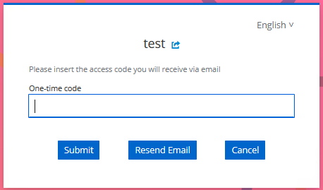

# 2FA Flow Tipps

2FA Flows should be encapsulated in a sub flow in keycloak
I've had the problem that there were multiple otp variants beeing offered.
When a user entered a wrong input the redirection to the error display would fail.

The solution to that problem is to encapsulate each otp variant in it's own sub flow

# Styled Pictures

Localization example

Error example

